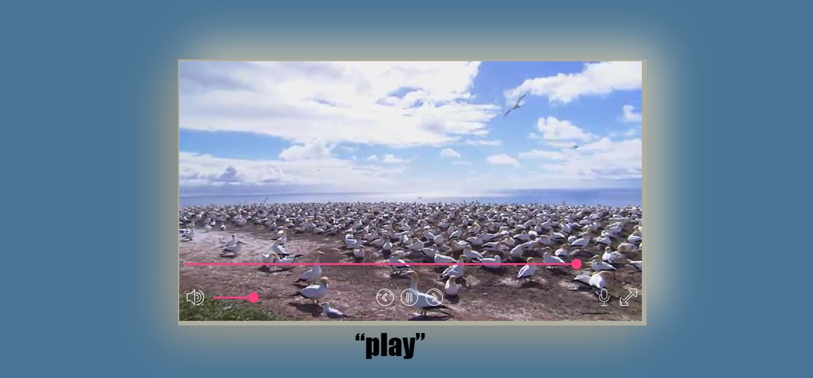

# Video Player

This is a custom Angular component encapsulating the HTML5 video api. This project is just to playaround with the default HTML5 video api by overriding its default controls and do quirky little things with it.

## Development server

Run `ng serve` for a dev server. Navigate to `http://localhost:4200/`. The app will automatically reload if you change any of the source files.
    

## Quirky functionalities 

### SPEECH CONTROL : Control the player through speech 
- The ability to control the video through speech.
- The video player has been enabled to be controlled using voice. Just press the 'microphone' icon and when (mic +) icon is shown, speak either of the following commands:
    - PLAY / START - To start the video
    - PAUSE / STOP - To pause the video
    - FULLSCREEN - Enable fullscreen
    - MUTE - Mute the video
    - VOLUME - Unmute the video
- Press the microphone button each time you want to speak a command
- For now the functionality is only available in chrome based browsers.

### CUSTOM CONTROL : Control the behavior of the player with custom buttons

- All prebuilt control buttons have been disabled, and custom buttons have been added. 
    
- Following custom buttons have been added (basic) :

1.  Play/Pause/Replay : To play, pause , replay(incase the video playback has ended)
2.  Rewind : Replay video by 5s. Initiated by pressing the left arrow key;
3.  Forward : Forward video by 5s. Initiated by pressing the right arrow key
4.  Volume : Volume Slider
5.  Mute / Unmute : Mute/ Unmute the audio. If audio has not changed it will go to a default value otherwise it will go to the previously changed value.
6.  Video slider : To slide through the video.
7.  Full screen : Make the video go full screen

- Also you can trigger the custom control button using keyboard buttons

1.  Play/Pause/Replay : Press the space bar
2.  Arrow Up : Increase the volume
3.  Arrow Down : Decrease the volume
4.  Arrow Right : Forward the video by 5s
5.  Arrow Left : Rewind the video by 5s

